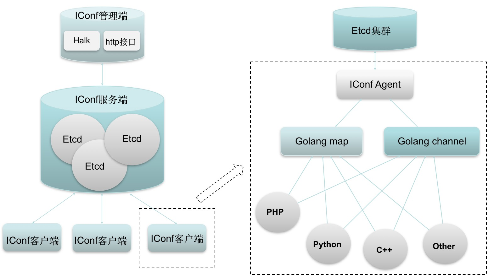

IConf
=====

## 简介
IConf 是一个分布式配置管理工具。
用来替代传统的配置文件，使得配置信息和程序代码分离，同时配置变化能够实时同步到客户端，而且保证用户高效读取配置，这使的工程师从琐碎的配置修改、代码提交、配置上线流程中解放出来，极大地简化了配置管理工作。

## 特点
* 一处修改，所有机器实时同步更新
* 高效读取配置
* 安装部署方便，使用简单
* 服务器宕机、网络中断、集群迁移等异常情况对用户透明
* 支持c/c++、shell、php、python、lua、java、go、node 等语言

## 编译安装
IConf采用Golang进行构建

## 使用

 - 搭建Etcd集群，并通过Etcd Client 新建修改配置

	 关于Etcd使用的更多信息: [Getting started with etcd](https://coreos.com/etcd/docs/latest/getting-started-with-etcd.html)

 - 在IConf 配置文件中配置Etcd集群地址

## 相关

## 性能
1. 测试策略
 * **测试次数** ： 循环测试1000次，每次循环获取分别获取10000个不同key对应的值，总共取一千万次key
 * **测试数据** ： 每个key对应的value的大小是1k
 * **测试方式** ： 多进程测试时候，多个进程同时运行，然后截取其中一段时间，来记录各个进程运行取一千万次的总耗时
 * **测试机器** ： Intel(R) Xeon(R) CPU E5-2630 0 @ 2.30GHz,  24核；64G memory
 * **测试语言** ： Golang
2. 测试结果

3. 结论
 *  
 *  

## 使用样例

## 文档

## 联系方式

* 邮箱:
* QQ群:
